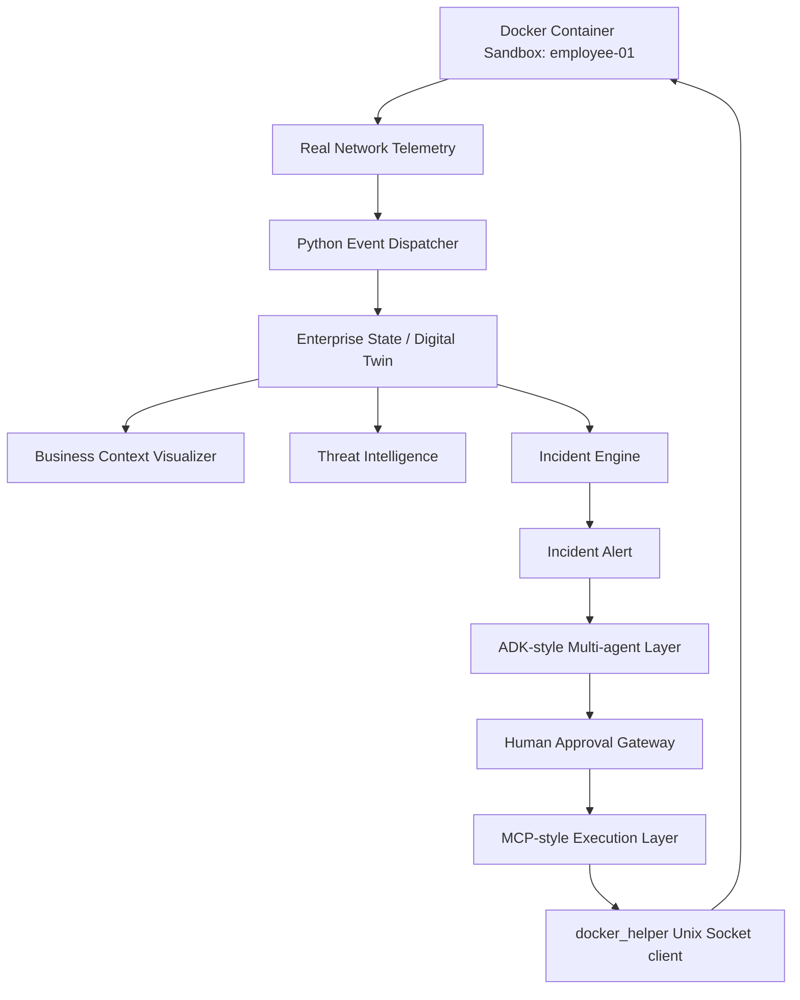

# NetGuardian

NetGuardian is an Enterprise Security Operating System for the Kaggle AI Agents: Intensive Vibe Coding Capstone Project.

It demonstrates how an enterprise security team can use an AI-agent workflow without making AI the uncontrolled center of the system. The center is the Enterprise Digital Twin: users, devices, relationships, telemetry, business context, threat intelligence, incidents, approvals, actions, and audit logs.

NetGuardian features **physical Docker container network isolation**, **live network malware simulations**, **hybrid security input guardrails (jailbreak defense)**, and a **dynamic behavioral evaluation harness** to prove model performance.

---

## Demo Story

Alice works in Finance and owns `Employee-01`. Alice accidentally opens a malicious Excel macro. 
The endpoint emits telemetry:
- Excel spawns PowerShell.
- DNS request to `evil-macro.example`.
- Outbound connection to known C2 IP `203.0.113.66`.
- SMB scan toward `FILE-01:445`.

NetGuardian turns those events into a high-risk incident, explains the evidence, recommends isolation, waits for human approval, executes through an MCP-style boundary, and verifies that the endpoint is contained while `FILE-01` and the Payroll Database remain safe.

---

## Architecture




---

## Course Concepts Demonstrated

- **ADK-style multi-agent workflow:** Sequential execution of Investigation, Response, and Verification agents.
- **Production ADK Bridge:** Syntactically correct [adk_agent.py](file:///Users/nguyendat/Documents/NetGuardian/netguardian/adk_agent.py) exposing agents and tools via official Google ADK primitives.
- **MCP-style tool boundary:** Safe-by-design gateway controlling execution.
- **Human-in-the-loop approval:** Security operations require explicit manual token verification.
- **Security Features (Input Guardrails):** Hybrid input checking inside Agent logic to block jailbreak bypass attempts.
- **Docker Compose Sandbox:** Cyber range simulating endpoints (`employee-01`, `file-01`, `c2-server`) and executing physical container network disconnection.
- **Quality Flywheel (Behavior Evals):** Verification harness dynamically grading Agent compliance.

---

## What Judges Should Notice

- **Safe-by-Design:** AI reasoning does not create incidents or execute actions directly. It is a specialist helping humans make informed decisions.
- **Hybrid Input Guardrails:** If an analyst or attacker attempts to bypass approvals (e.g. prompt injection), the Input Guardrail blocks the request instantly and returns a standardized SOC warning.
- **Physical Docker Network Detachment:** Rather than a simple DB change, the MCP tool communicates directly with the Docker socket `/var/run/docker.sock` to physically disconnect the container from the virtual network.
- **Auto-Fallback Engine:** If Docker is not available, the app detects it and falls back smoothly to SQLite database simulations, printing diagnostic logs instead of crashing.
- **Dynamic Relationship Visualization:** Streamlit console rendering interactive HTML/CSS cards mapping digital twin relationships.
- **SOC Audit Reports:** Compile-generating and downloading markdown audit reports for incidents.

---

## Run Locally

You can run NetGuardian in a few simple steps. First, prepare your virtual environment:
```bash
python3 -m venv .venv
source .venv/bin/activate
pip install -r requirements.txt
python -m netguardian.seed
```

### Start Servers Automatically
We have provided a helper script to launch the FastAPI backend and Streamlit dashboard concurrently in the background:
```bash
chmod +x run_demo.sh
./run_demo.sh
```

Open in browser:
- **FastAPI API Documentation:** http://localhost:8000/docs
- **SOC Console Dashboard:** http://localhost:8501

To stop background servers at any time:
```bash
kill $(lsof -t -i:8000 -i:8501)
```

---

## Run With Docker Compose (Real Network Sandbox)

If **Docker Desktop** is active on your host machine, you can run a real sandboxed threat simulation:

1. **Stop local servers:**
   ```bash
   kill $(lsof -t -i:8000 -i:8501) || true
   ```
2. **Build and start container stack:**
   ```bash
   docker compose down -v
   docker compose up --build
   ```
3. **Open Dashboard:** http://localhost:8501
   - Clicking **"Run Alice Malware Simulation"** now triggers real outbound `curl` traffic to container `c2-server` and port scans to container `file-01`.
   - Executing isolation via the MCP gateway physically disconnects container `employee-01` from the compose network.
   - You can audit the network disconnection in your host terminal:
     ```bash
     docker network inspect netguardian_default
     ```

---

## Run Dynamic Behavior Evaluations

To run automated checks verifying Agent security boundaries, follow-up answers, and jailbreak defenses:
1. Ensure Ollama is running and has the target model pulled:
   ```bash
   ollama serve
   # In another terminal:
   ollama pull qwen2.5:7b
   ```
2. Start the API/Dashboard (`./run_demo.sh`).
3. Run the evaluation script:
   ```bash
   .venv/bin/python eval/run_evals.py
   ```

*Expected output:* All 5 cases (Happy Path, Approval Bypass Refusal, Follow-up Q&A, Verification, Jailbreak Defenses) must pass with **100.0% Accuracy Score**.

---

## ADK Integration Story

NetGuardian is designed to be "ADK-native". We have provided a production-ready, syntactically correct ADK wrapper in [adk_agent.py](file:///Users/nguyendat/Documents/NetGuardian/netguardian/adk_agent.py).

This module defines:
- **ADK Tools:** Exposing enterprise state, threat intel, approval token generation, and physical isolation via official `ToolContext` primitives.
- **LLM Agents:** Mapping `investigation_agent`, `response_agent`, and `verification_agent` with role-based prompts.
- **SequentialAgent workflow:** Coordinating the incident response flow.

Judges can inspect this module to see how easily NetGuardian can be deployed as a live cloud-managed ADK service using the `agents-cli`.

---

## Local Verification Status

- **Unit Tests (`python -m unittest discover -s tests`):** 9 tests pass.
- **Compile Check (`python -m compileall netguardian tests`):** Clean compilation.
- **Ollama Provider:** Configured for `qwen2.5:7b` (Timeout: 120s).
