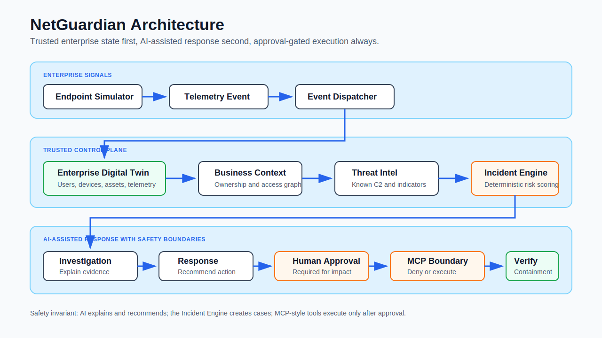
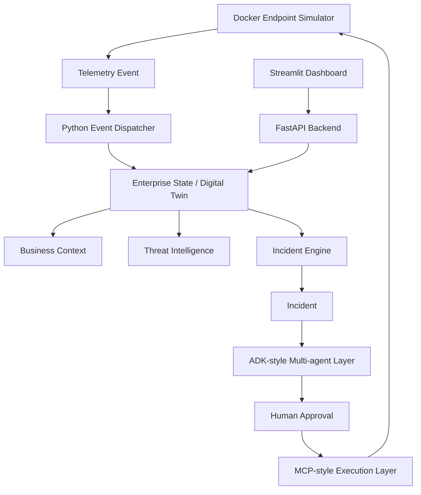
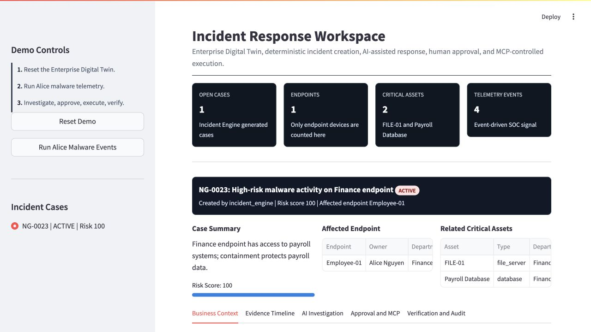

# NetGuardian

NetGuardian is an Enterprise Security Operating System for the Kaggle AI Agents: Intensive Vibe Coding Capstone Project.

It demonstrates how an enterprise security team can use an AI-agent workflow without making AI the uncontrolled center of the system. The center is the Enterprise Digital Twin: users, devices, relationships, telemetry, business context, threat intelligence, incidents, approvals, actions, and audit logs.

The current MVP is a complete local demo: FastAPI backend, SQLite Enterprise Digital Twin, deterministic Incident Engine, ADK-style multi-agent workflow, MCP-style approval boundary, Streamlit SOC dashboard, Docker Compose configuration, unit tests, and evaluation cases.

## Demo Story

Alice works in Finance and owns `Employee-01`, which can access critical Finance assets: the `FILE-01` file server and the Payroll Database it hosts. Alice accidentally opens a malicious Excel macro. The endpoint emits suspicious telemetry: PowerShell launched from Excel, DNS resolution to a malicious domain, outbound C2 connection, and SMB scanning toward `FILE-01`.

NetGuardian turns those events into a high-risk incident, explains the evidence, recommends isolation, waits for human approval, executes through an MCP-style boundary, and verifies that the endpoint is contained while `FILE-01` and the Payroll Database remain safe.

## Architecture





## Course Concepts Demonstrated

- ADK-style multi-agent workflow: Investigation, Response, and Verification agents.
- MCP-style tool boundary for controlled execution.
- Human-in-the-loop security approval.
- Deterministic Incident Engine and Enterprise Digital Twin.
- Local evaluation cases and unit tests.
- Docker Compose deployability.

## What Judges Should Notice

- NetGuardian is not a generic chatbot. It is an incident workflow built around trusted enterprise state.
- Incidents are created deterministically by the Incident Engine, not invented by an LLM.
- Agents operate as specialists: investigate, recommend, and verify.
- Dangerous response actions require human approval before execution.
- MCP-style tools enforce the approval boundary and record every denied or successful action.
- The demo connects technical telemetry to business impact: Finance ownership, `FILE-01`, and the Payroll Database.

## Run Locally

```bash
python3 -m venv .venv
source .venv/bin/activate
pip install -r requirements.txt
python -m netguardian.seed
uvicorn netguardian.api:app --reload
```

In another terminal:

```bash
source .venv/bin/activate
streamlit run netguardian/dashboard.py
```

Open:

- API: http://localhost:8000/docs
- Dashboard: http://localhost:8501

## Run With Docker Compose

```bash
docker compose up --build
```

Open the dashboard at http://localhost:8501.

## Demo Flow

1. Click `Reset Demo`.
2. Click `Run Alice Malware Events`.
3. Review the generated high-risk incident.
4. Run Investigation Agent.
5. Run Response Agent.
6. Ask a custom follow-up question.
7. Approve isolation.
8. Execute isolation via MCP.
9. Run Verification Agent.

## Screenshots

Dashboard overview:



Additional media assets for the Kaggle gallery are available in `docs/media/`:

- `netguardian-architecture.svg`
- `01-dashboard-overview.jpg`
- `02-evidence-timeline.jpg`
- `03-ai-investigation-response.jpg`
- `04-approval-mcp-execution.jpg`
- `05-verification-audit.jpg`

## ADK Integration Story

The MVP now supports local and cloud agent modes:

- `deterministic`: reproducible local fallback for tests and offline demos.
- `local_ollama`: optional local AI reasoning through Ollama.
- `live_gemini`: optional Gemini reasoning when `GOOGLE_API_KEY` or `GEMINI_API_KEY` is available.

The code is structured around the same roles that would become ADK agents:

- Investigation Agent reads Enterprise State and incident evidence.
- Response Agent recommends a bounded action and explains the trade-off.
- Verification Agent checks containment and business impact.

Live/local AI enriches analyst-facing reasoning only. It does not create incidents, choose arbitrary actions, bypass approval, or execute tools. The Incident Engine still owns incident creation, and the MCP-style boundary still owns approved execution.

The dashboard also includes an `Ask Investigation Agent` follow-up box. This is the best place to show live local AI because it answers analyst questions from the incident bundle without changing deterministic incident creation, approval, execution, or verification behavior.

The next integration step is to wrap the existing `NetGuardianAgents` and `NetGuardianMCP` interfaces as ADK tools, then run behavior evaluation through Agents CLI. See `docs/adk-integration-plan.md` for the migration plan.

To enable local AI with Ollama:

```bash
ollama serve
ollama pull qwen2.5:7b
export NETGUARDIAN_AI_MODE=live
export NETGUARDIAN_AI_PROVIDER=ollama
export NETGUARDIAN_OLLAMA_MODEL=qwen2.5:7b
.venv/bin/uvicorn netguardian.api:app --host 127.0.0.1 --port 8000
```

To enable Gemini instead:

```bash
export NETGUARDIAN_AI_MODE=live
export NETGUARDIAN_AI_PROVIDER=gemini
export GOOGLE_API_KEY=your-key-here
.venv/bin/uvicorn netguardian.api:app --host 127.0.0.1 --port 8000
```

Keep real API keys in your local environment only. Do not commit them. Ollama does not require a cloud API key.

## Test

The core logic uses only Python standard library plus Pydantic, so it can be tested without FastAPI or Streamlit installed:

```bash
python3 -m unittest discover -s tests
```

Current verified state:

- `python3 -m unittest discover -s tests`: 9 tests pass.
- `.venv/bin/python -m unittest discover -s tests`: 9 tests pass.
- `.venv/bin/python -m compileall netguardian endpoint_simulator tests`: clean.
- `docker compose config`: valid.
- `agents-cli info`: recognizes this as project `netguardian`; deployment target is currently `none`.

## Safety Model

- AI does not create incidents; the Incident Engine does.
- AI does not execute actions directly.
- Enterprise State is the single source of truth.
- High-impact actions require human approval.
- MCP-style execution denies unapproved actions.
- Every recommendation, approval, action, and verification is logged.
