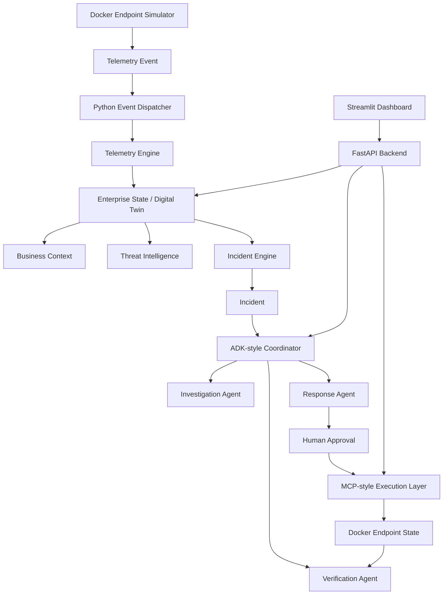

# NetGuardian Architecture

## Core Rule

Enterprise State is the single source of truth. Agents do not inspect Docker directly and do not create incidents directly.

## Services

- FastAPI backend: central API for state, incidents, recommendations, approvals, and execution.
- SQLite: local Enterprise Digital Twin.
- Streamlit dashboard: human operator interface.
- MCP-style execution module: controlled action boundary.
- Endpoint simulator: emits demo telemetry.

